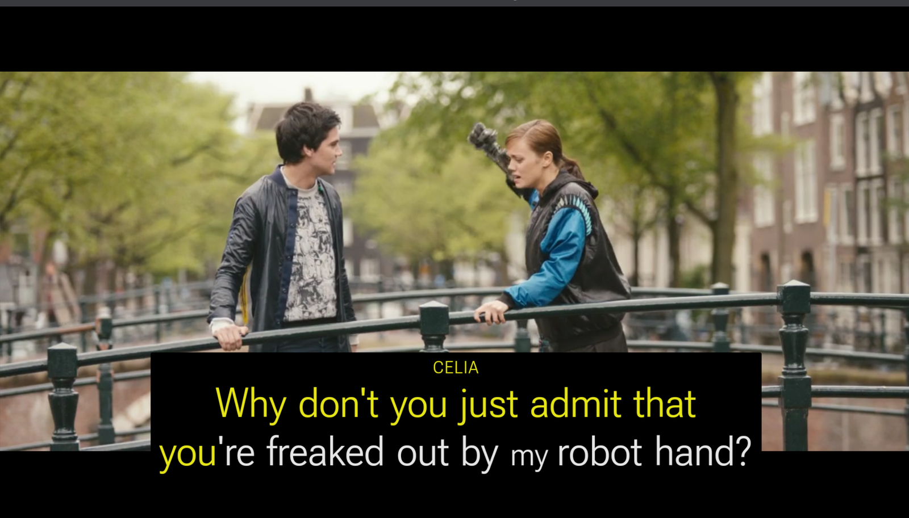
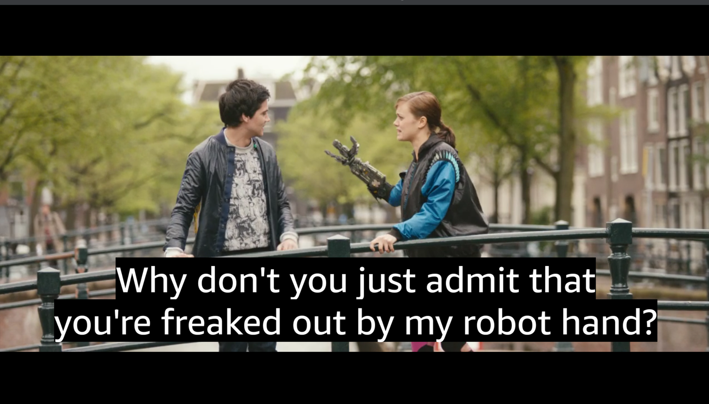
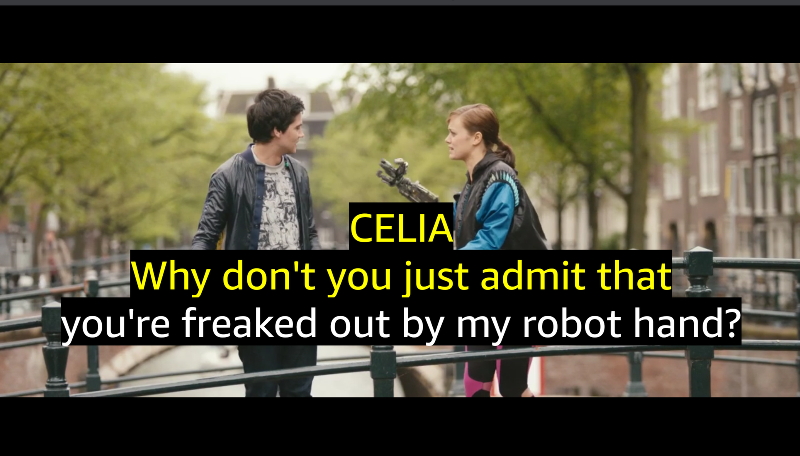
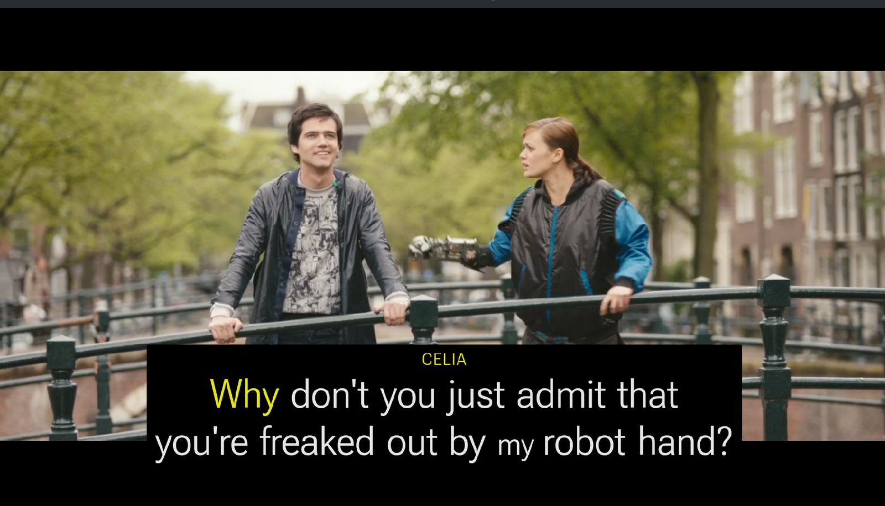
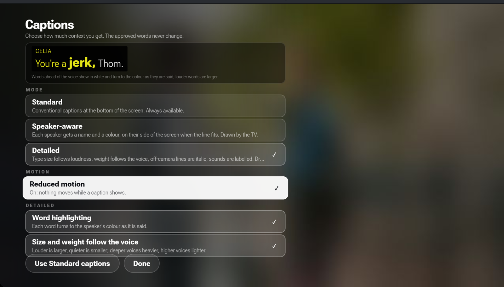
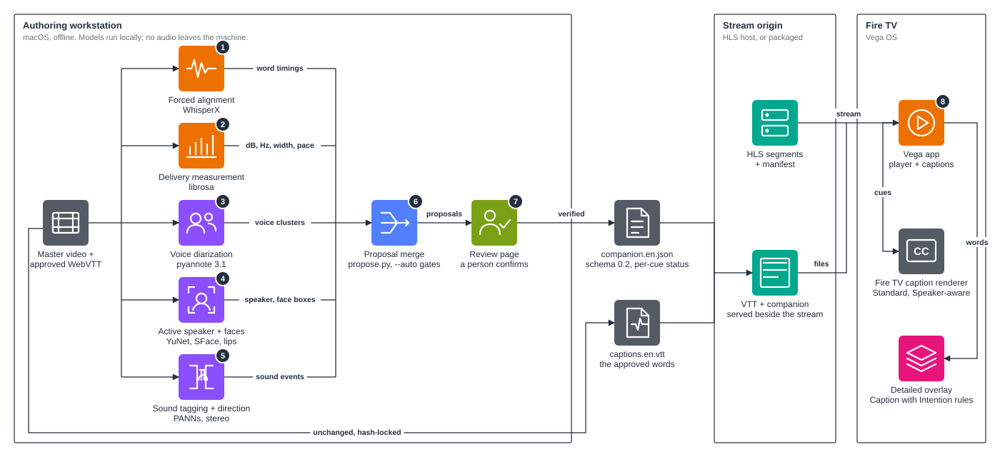
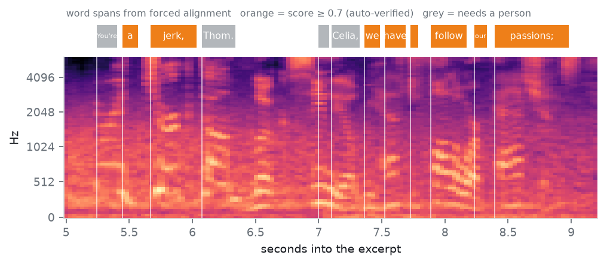
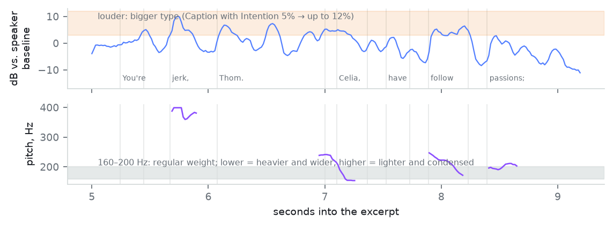
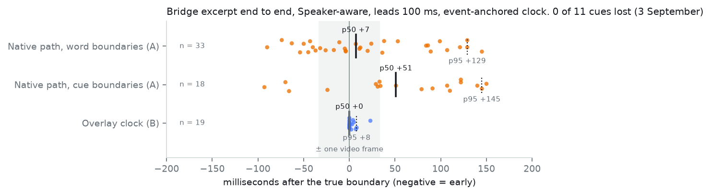

# Sightline

Captions for Fire TV that show who is speaking, how loud, and when.

Demo video (3 minutes): https://youtu.be/tEMhDXov5MM



Sightline is a caption runtime for Fire TV (Vega OS). It takes an approved WebVTT caption track and a verified companion file, and draws the captions at the richest level the viewer, the TV's caption settings and the verified data allow. Anything unverified falls back, one cue at a time, to ordinary captions. The approved words never change. Built for the Fire TV track of the Build, Ship, Shape Amazon Developer Hackathon 2026.

## Three modes, one press apart

| Standard | Speaker-aware | Detailed |
|---|---|---|
|  |  |  |
| The captions as written, drawn by the TV in the viewer's own caption style. | A name and a colour per speaker, on the speaker's side of the screen when the line fits. Each word turns to the colour as it is said. Still the TV's renderer. | The Caption with Intention design system: size follows loudness, weight follows the voice, off-camera lines in italics, sounds labelled. Drawn by the app. |

| Detailed with motion | The Captions sheet |
|---|---|
|  |  |
| Off by default. When on, the word being spoken lifts for a moment. | Mode, motion and the Detailed toggles, with a live preview. Saved on the device. Standard captions are always one press away. |

## How it works



Nothing is guessed. Five measurements run on every scene: word timing against the sound, loudness and pitch per word against the speaker's own normal, voice separation, face regions a caption must not cover, and sound events. One step merges them into proposals, and a person confirms them in a local review page. The caption file is never edited; a hash locks the companion file to it. On the TV, every cue passes a ladder of checks, and each failed check keeps the approved words on screen and records why the extra was dropped.

| Word timing against the sound | Loudness and pitch per word |
|---|---|
|  |  |

## Measured



On the Vega Virtual Device, one scene start to finish, word changes land within about 10 ms of the boundary at the median and cue changes within about 50 ms, with p95 near 145 ms and no cue lost. The method and the runs are in `docs/sync-report.md`.

## Run it

```bash
npm install
npm test                       # 51 core, 17 runtime, 5 app tests; no Fire TV needed
npm run validate -- assets/the-envelope/captions.en.vtt assets/the-envelope/companion.en.json
```

To try it without building, install the package from the [v0.1.0 release](https://github.com/samadon1/sightline/releases/tag/v0.1.0) on the Vega Virtual Device:

```bash
vega run-app vega-player_aarch64.vpkg com.sightlinewip.player.main -d VirtualDevice
```

To build it yourself (Vega SDK 0.24, React Native for Vega 0.83):

```bash
npm run bundle-assets
cd apps/vega-player && npm run build:release
vega virtual-device start
vega run-app build/aarch64-release/vega-player_aarch64.vpkg com.sightlinewip.player.main -d VirtualDevice
```

The three scenes play from a packaged copy, so the app does not depend on a media server. The review page for authoring a scene: `python3 tools/author/review_server.py assets/tos-bridge`.

## Repository

- `apps/vega-player`: the Fire TV app (React Native for Vega).
- `packages/vega-captions`: the caption runtime as a package other Vega apps can embed.
- `packages/core`: the portable core, no React Native imports: WebVTT parser, cue hashes, companion schema and validator, label and lane rules, resolver.
- `schema`: the companion profile.
- `tools/author`: the measurement and proposal pipeline and the review page. `tools/video`: the demo video builder.
- `docs`: `reference.md` (the full technical write-up), `architecture.md`, `authoring.md`, `sync-report.md`, `accessibility-decisions.md`, `prior-art.md`, `friction-log.md`, and the measurement record.

## Built on

The Caption with Intention design system (FCB Chicago and the Chicago Hearing Society), the caption research listed in `docs/prior-art.md`, Amazon's `vega-video-sample` for the player wiring, and two excerpts of *Tears of Steel* (Blender Foundation, CC BY 3.0).

## Licence

Apache License 2.0 for the code (`LICENSE`). Our own documents, figures and captures are CC BY 4.0. Third-party material keeps its own licence; see `docs/licensing.md`.
