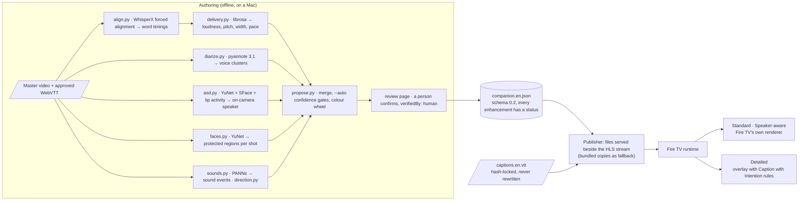
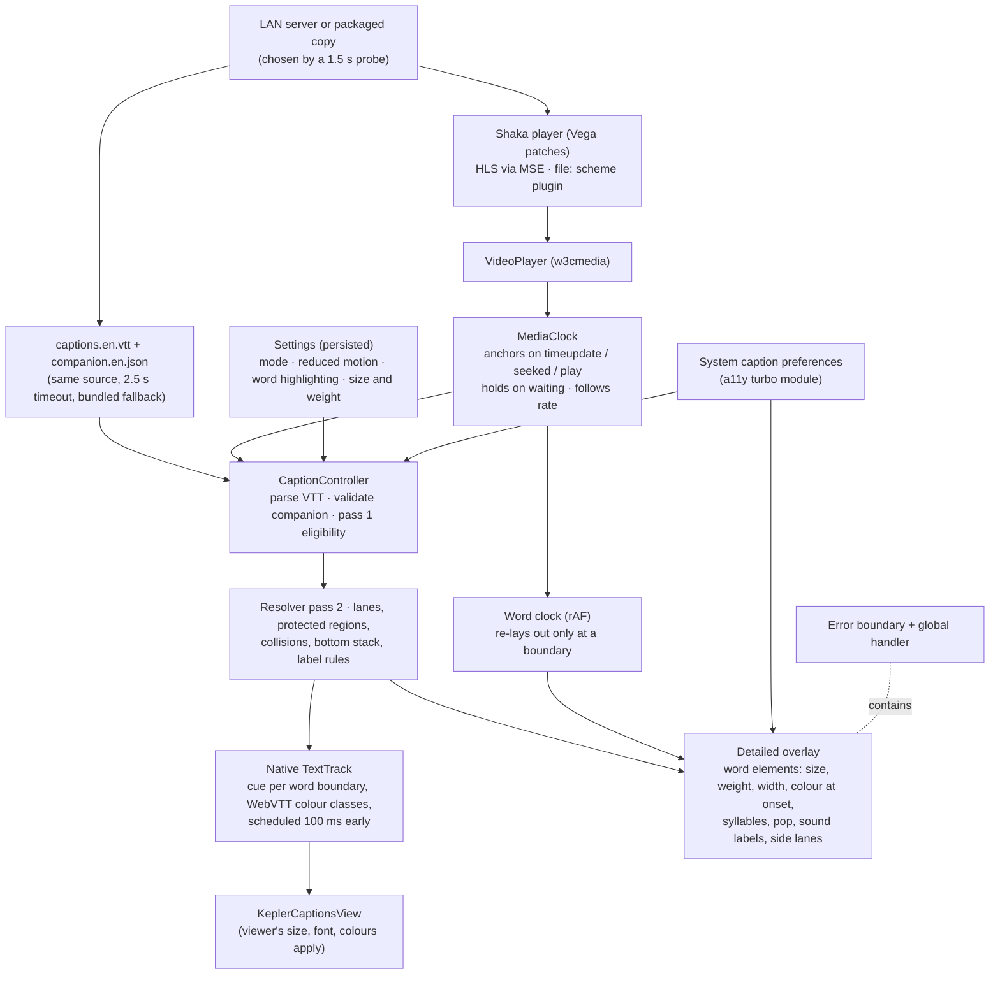
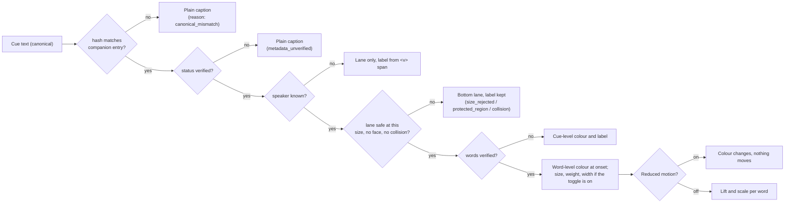

# Architecture diagrams (September 2, 2026)

Mermaid sources for the diagrams on the architecture page; GitHub renders them. Text description: docs/architecture.md.

## The whole system

## The runtime on the TV

## What decides what a viewer sees

## The companion file, in one table

| Field | Produced by | Verified by | Used by |
|---|---|---|---|
| `cues[id].textHash`, `status` | propose.py from the track | human or auto rule | gate for every enhancement |
| `speaker`, `lanes` | track voice spans; diarization and face proposals | human (auto when the voice agrees with the track) | label, colour, lane, italics |
| `words[]` timing, `loudDb`, `pitch`, `width`, `caps`, `stretch` | WhisperX, librosa | auto above score 0.7, else human | native cue splitting; overlay size, weight, width, colour, syllables |
| `delivery` | librosa (measurements) | auto | cue-level size and width, manner label |
| `shots[].protected` | face detector | proposed; honoured either way (safe direction) | lane rejection |
| `sounds[]` | PANNs, stereo direction | auto above 0.8, named by a human | bracketed labels, ♫, direction markers |
| `speakers[].color` | `--assign-colours` (Caption with Intention wheel) | human override | character colour, native colour class |
