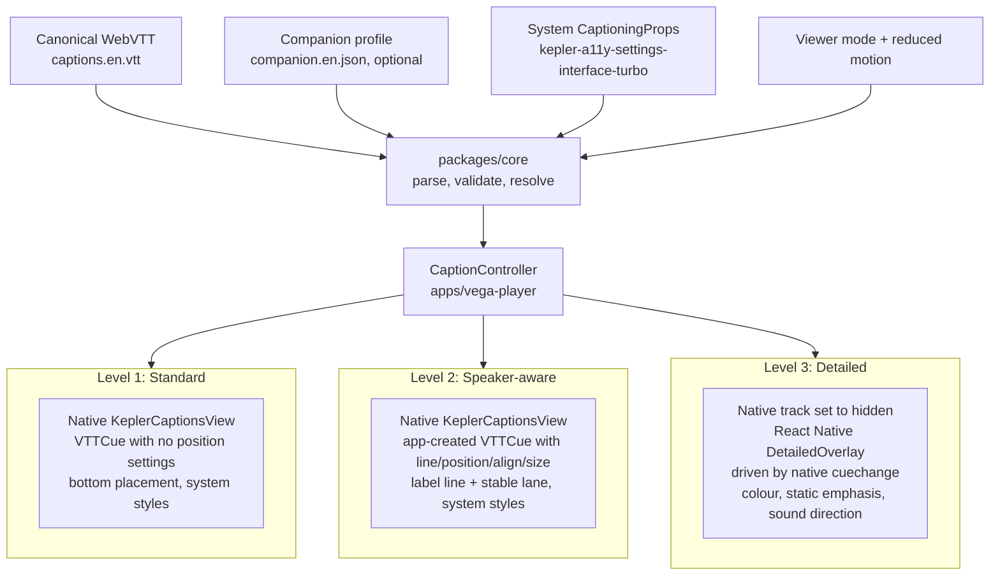

# Architecture

This document describes how the caption runtime is built today, as verified on the Vega Virtual Device (VVD) on September 1 and 2, 2026. Where something has not been tested, it says so.

## 1. What the runtime does

The runtime takes an approved WebVTT caption track, an optional companion metadata file, the viewer's mode choice, and the TV's own caption settings, and renders the richest presentation that all of those allow. When an enhancement is unavailable, unsafe, unverified, or unwanted, that cue falls back to a conventional caption. The canonical text is never changed.

The invariant, from the spec: an enhancement may disappear; the canonical caption may not.

## 2. Native-first hybrid: three levels

Levels 1 and 2 are drawn by the platform's own caption renderer (`KeplerCaptionsView`). Only Level 3 uses a custom overlay, and even there the native text track remains the timing source.



| Level | Renderer | Timing source | What it adds | Honours system caption settings |
|---|---|---|---|---|
| 1 Standard | `KeplerCaptionsView` | Native | Nothing. Canonical cues at the default bottom position. | Yes, automatically |
| 2 Speaker-aware | `KeplerCaptionsView` | Native | A speaker label line on the first cue of a run (and other rule-defined boundaries) and a stable lane (`lower_left`, `lower_right`, `bottom_center`) expressed as `VTTCue` settings | Yes, automatically |
| 3 Detailed | React Native overlay (`DetailedOverlay.tsx`) | Native `cuechange` on a hidden track | Everything in Level 2 plus the Caption with Intention treatment: read-ahead text, word colour at onset, type size from loudness, weight and width from the voice, italics off camera, sound labels with direction and level | Applied explicitly by the overlay: `textSize`, `textColor`, `textBackgroundColor`, `textBackgroundOpacity`, `textEdgeStyle`. Font family and window background are not yet applied. |

Why this shape: native positioned cues make Level 2 free of custom sync code and give it the platform's caption size, font, edge, and background for free. Mode switches between Levels 1 and 2 rebuild the cue list on the same text track, so there is no renderer switch and no flash (verified in Gate 1). Level 3 is the only place a custom overlay is needed, and the product still works if Level 3 is cut.

Only one `KeplerCaptionsView` is ever mounted per process. The `show` prop is `false` in Detailed mode so native and overlay captions cannot appear together.

## 3. Runtime initialization sequence

```mermaid
sequenceDiagram
    participant App as PlayerScreen
    participant VP as VideoPlayer (w3cmedia)
    participant CC as CaptionController
    participant Core as packages/core
    participant Shaka as ShakaPlayer (MSE)
    participant Surface as KeplerVideoSurfaceView / KeplerCaptionsView

    App->>VP: new VideoPlayer(), setMediaControlFocus(), initialize()
    App->>VP: add listeners (loadedmetadata, play, pause, seeked, ended, error, timeupdate)
    App->>VP: autoplay = false
    App->>VP: addTextTrack("subtitles", "Captions", "en")
    App->>CC: new CaptionController(track, vttText, companion, viewerPrefs, systemPrefs)
    CC->>Core: parseVtt(vtt)
    CC->>Core: validateProfile(companion, cues)
    CC->>Core: resolveTrack(...) (pass 1) and resolveAlone(...) (pass 2 per overlap group)
    CC->>VP: track.addCue(VTTCue...) for every cue, then track.mode = showing or hidden
    App->>Shaka: load(hlsUri)
    VP-->>App: loadedmetadata (first only; second is ignored)
    App->>Surface: mount KeplerVideoSurfaceView + KeplerCaptionsView
    Surface-->>App: onSurfaceViewCreated(handle), onCaptionViewCreated(handle)
    App->>VP: setSurfaceHandle(h), setCaptionViewHandle(h), play()
    VP-->>CC: track.oncuechange (also while hidden)
    CC-->>App: overlay state (Detailed only)
```

Order of the steps in words (spec section 11.3, as implemented in `apps/vega-player/src/screens/PlayerScreen.tsx` and `packages/vega-captions/src/controller/CaptionController.ts`):

1. Create and initialize the media player; take media-control focus.
2. Register media event listeners. `loadedmetadata` fires twice on the Shaka path (friction log FL-010), so a flag ignores the second one.
3. Create one `subtitles` text track.
4. Construct the `CaptionController`. In its constructor: parse the canonical VTT; validate the companion file against the parsed cues; read the viewer and system preferences it was given; run pass 1 of the resolver; lay out the native cue set; add every cue to the native track; set the track mode (`showing` for Standard and Speaker-aware, `hidden` for Detailed).
5. Load the HLS rendition through the Vega-patched Shaka player.
6. On the first `loadedmetadata`, mount the video surface and the caption view. When their handles arrive, attach them to the player and call `play()` once.
7. From then on, native `cuechange` drives the Detailed overlay, and `play`, `pause`, `seeked`, `ended`, and mode changes call `recompute()` so the overlay never shows a stale cue.
8. System caption preference changes (`useSystemCaptionPrefs`) and viewer setting changes call `setSystem()` / `setViewer()`, which rebuild the native cue set.

## 4. Playback path on the VVD

```text
MP4 master
  -> tools/hls/make-hls.sh (ffmpeg, fMP4 single-file HLS)
  -> assets/<scene>/hls/placeholder.m3u8 served by http-server on the Mac
  -> Vega-patched Shaka player 4.8.5 (copied from AmazonAppDev/vega-video-sample)
  -> Media Source Extensions path in react-native-w3cmedia
  -> KeplerVideoSurfaceView
```

URL-mode playback (giving the player a plain MP4 URL) fails on this VVD image for every source tried, including the official sample when forced into URL mode, with native `Open failed -1 / MPB 50004`. This is documented in `docs/friction-log.md` FL-008 and is a VVD finding, not an app bug. Whether URL mode works on a physical Fire TV Stick is untested. `media/config.ts` keeps an `mp4Uri` per scene for that test.

Because of FL-008, the HLS rendition and the Shaka path are the only playback path this prototype has exercised. `ShakaPlayer.ts` and its polyfills carry Amazon's proprietary header from the sample and are included so a clean checkout builds; they are not part of the open-source core.

## 5. The two-pass resolver (`packages/core/src/resolver.ts`)

The resolver is deterministic and has no I/O. It never throws for a single cue: a cue whose resolution fails is emitted as plain canonical text and later cues continue.

### Pass 1: `resolveTrack(cues, profile, options)` -> `EligibleCue[]`

Runs once per (track, mode, preferences) and is cached by the controller. Processes cues in track order because label decisions depend on the previous cue.

Inputs:

- the canonical cues (`CanonicalCue`: id, start, end, `rawText`, `plainText`, optional `<v>` voice name, timing-line settings)
- the companion profile, or null
- viewer preferences (`mode`, `reducedMotion`)
- system caption preferences (subset of `CaptioningProps`, used for the size scale)
- runtime capabilities (`NATIVE_VEGA_CAPABILITIES`: positioned cues yes, colour no, emphasis no; `OVERLAY_CAPABILITIES`: all yes)
- label rule configuration (`DEFAULT_LABEL_RULES`)
- optional voice-span lane hints (compatibility rung when no companion file exists)
- an `onError` callback

Per cue it decides, in this order:

1. In Standard mode: emit canonical text, reason `mode_standard`, stop.
2. Which shot the cue starts in.
3. Whether the companion entry is usable: present, `status === "verified"`, and its `textHash` matches the canonical visible text. Otherwise the reason is `metadata_missing`, `metadata_unverified`, or `canonical_mismatch`.
4. Speaker: from a verified `speaker` or a two-id `speakers` pair (dual-speaker cue), else from the canonical `<v Name>` span. Unknown ids give `speaker_unknown`.
5. Label text through the reveal policy (`speakerLabelAt`: generic label before `revealAtMs`) and the label-frequency rule (`shouldShowLabel`). If the canonical text already starts with the same bracketed id, the label is suppressed (`canonical_id_present`) so nothing is double-labelled.
6. Colour token: only in Detailed with a colour-capable renderer; otherwise `color_unsupported`.
7. Candidate lanes: verified companion lanes, else the voice-span hint, else nothing; `bottom_center` is always appended.
8. Static emphasis: Detailed only, verified only, token indices bounds-checked (`emphasis_invalid` for bad ones).
9. Sound direction: Detailed only, verified only; the sound text itself is canonical and always shown.

Outputs per cue: canonical visible text, speaker id and label, colour token, candidate lanes in order, static emphasis, sound direction, `isSound`, shot id, `appliedFeatures`, and `fallbackReasons`.

### Pass 2: `layoutActiveSet(active, context)` -> `ResolvedCaption[]`

Runs on every cue change for the cues active at that media time (Detailed overlay), and once per overlap group at build time for the native cue set (`resolveAlone`).

Inputs:

- the pass-1 outputs for the active set
- the font scale for the current system caption size (`fontScaleFor`)
- protected regions of the current shot
- previous lane per speaker within the shot (continuity)

Rules:

- Cues are processed in start-time order; the first claims its preferred lane, later ones avoid it.
- A side lane is rejected when the estimated box wraps past a label plus two dialogue lines (three lines with a label, two without), or is taller than 35% of the viewport (`size_rejected`); leaves the title-safe area (`size_rejected`); overlaps a protected region (`protected_region`); or overlaps an already placed box (`collision`).
- Three or more simultaneous dialogue cues force a bottom stack.
- Everything that lands at the bottom is stacked in reading order (`stackIndex`); when two dialogue cues share the bottom, labels are forced on so attribution survives.
- A directional sound that could not take its lane loses its direction marker but keeps its text.

Outputs per cue: final lane, stack index, label, colour token, emphasis, sound direction, applied features, and fallback reasons.

## 6. Lane estimator calibration (`packages/core/src/lanes.ts`)

The native renderer does not expose measured cue bounds, so `estimateLaneBox()` estimates the box from character count, line count, and a font scale. The constants were calibrated once, on the VVD at `CaptionTextSize = normal`, on September 1, 2026 (`docs/gate-1-prototype.md`):

- one native caption line is about 9.5% of viewport height
- one character is about 1.74% of viewport width

In the current code a side lane accepts a label plus up to two dialogue lines and never more than 35% of the viewport height; anything longer or taller goes to the bottom lane. (The Gate 1 results note recorded a tighter budget, a label plus one line, at the time of calibration; the budget was widened afterwards and is a tuning choice, not a new measurement.) The estimator is deliberately conservative: a false fallback is preferred to a caption that overflows or covers something.

The font scale per system size is a mapping, not a measurement: `very_small` 0.6, `small` 0.8, `normal` 1.0, `large` 1.5, `very_large` 2.0. Only `normal` has been calibrated against the device. The size-driven fallback has been exercised through the app's own scale keys (at 1.25x the 21-character prototype cue dropped to the bottom; at 1.5x all side-lane cues dropped), not yet through the real system setting, because the VVD Settings UI has no Accessibility page.

Lane cue settings (percentages, `snapToLines: false`):

| Lane | line | position | positionAlign | align | size |
|---|---|---|---|---|---|
| `bottom_center` | 90 | 50 | center | center | 80 |
| `lower_left` | 85 | 8 | line-left | start | 42 |
| `lower_right` | 85 | 92 | line-right | end | 42 |

## 7. CaptionController responsibilities (`packages/vega-captions/src/controller/CaptionController.ts`)

The controller is framework-free apart from the injected native factories (`makeCue`, `track`, `now`), so it can be unit-tested in Node.

It owns:

- the parsed canonical cues and the companion profile (or null)
- the companion validation result, exposed to the About and diagnostics screens
- the pass-1 eligibility cache for the current mode and preferences
- the native text track: it removes the previous cue objects and adds the new ones on every rebuild, and sets `track.mode` (`showing` or `hidden`)
- the Detailed overlay state, published to subscribers
- `previousLaneBySpeaker` for lane continuity within a shot

It reacts to:

- `setViewer()` and `setSystem()`: rebuild pass 1 and the native cue set (skipped when the values have not changed)
- native `cuechange`: log a `[sync]` line and, in Detailed, run pass 2 for the active set
- `recompute(reason)` from play, pause, seeked, ended, and mode change
- `expectedAt(timeMs)` for the second clock (Measurement B)

Protected regions: the native cue set (Standard and Speaker-aware) is laid out once at build time with no protected regions, because a native cue cannot be re-laid-out per shot after it is added to the track. Protected regions are applied in the Detailed overlay's per-cue-change layout, using the shot at the current media time.

Companion handling: a companion file with structural errors (bad schema version, bad speakers or shots tables) is rejected wholesale and the scene plays with Standard captions. Per-cue errors (hash mismatch, unknown speaker) keep the profile but the affected cue's enhancement is ignored by the resolver.

## 8. Settings model

The app exposes four viewer settings (mode, Reduced motion, word highlighting, size and weight from the voice) (`apps/vega-player/src/settings/store.ts`):

| Setting | Values | Default |
|---|---|---|
| Caption mode | `standard`, `speaker-aware`, `detailed` | `speaker-aware` |
| Reduced motion | on, off | on |

Settings persist on the device (async storage) and reload at launch; there are no accounts or cloud profiles. The settings panel works both as a full screen from the landing page and as an overlay during playback. A dedicated "Use Standard captions" action returns to Standard in one press from anywhere it appears (settings panel, end-of-scene card).

Nothing animates in P0 whichever way Reduced motion is set; the toggle exists so the default is recorded and so future presentation options have a home. There is no Vega system reduce-motion setting to inherit from.

## 9. Remote mapping (`apps/vega-player/src/remote/useRemote.ts`)

One module maps raw `useTVEventHandler` event types to app actions so screens never see key names. Only key-down (`eventKeyAction === 0`) is handled. Unrecognized events are logged as `[remote] unmapped event "<name>"`.

| Raw event type(s) | Action |
|---|---|
| `up`, `down`, `left`, `right` | navigation / seek |
| `select`, `enter`, `ok` | `select` (the OK button on the VVD remote arrives as `enter`, so all three are mapped) |
| `back` | `back` |
| `menu` | `menu` |
| `playpause` | `playpause` |
| `skip_backward`, `rewind`, `fast_backward` | `skipBack` |
| `skip_forward`, `fast_forward` | `skipForward` |
| `info`, `more` | `info` |
| `page_up`, `page_down` (also `pageup`, `pagedown`) | `pageUp`, `pageDown` |

During playback (`screens/PlayerScreen.tsx`):

- Select or Play/Pause: toggle playback and show the transport line
- Left / Right: seek 10 s back / forward
- Menu: open the caption settings overlay (Back or Menu closes it)
- Back: close the transport line, else leave playback
- Skip back: return to 0; Skip forward: +30 s
- Info: toggle the hidden diagnostics panel
- Page Up / Page Down: development only; ask the system to change caption text size (expected to be refused for a third-party app)

Known gap: `KEY_REWIND` sent from `inputd-cli` did not arrive as `skip_backward` or `rewind` on September 1; event names are now logged so the real name can be mapped.

## 10. Diagnostics

- `diagnostics/log.ts`: `devLog()` writes to `console.info` and to a 40-line ring buffer. On the device these lines appear under the `[KeplerScript-JavaScript]` tag in `vega device start-log-stream`. Only `console.info/warn/error` reach the device log.
- `syncLog()` writes the structured measurement line used for the sync numbers: `[sync] wall=<ms> media=<ms> event=<name> expected=<ids> rendered=<ids> lane=<lane> mode=<mode>`.
- The Info key toggles `DiagnosticsPanel`, which shows the last 18 lines and a header with mode, play state, media clock, estimator scale, and the system `textSize`. It is never part of the viewer flow or of release captures.
- Log prefixes in use: `[player]`, `[surface]`, `[captions]`, `[kmc]`, `[vtt]`, `[companion]`, `[resolver]`, `[mode]`, `[sync]`, `[a11y]`, `[remote]`, `[clockB]`, `[window]`.
- Keep per-frame state updates out of the player screen. The app log rate limit (300 lines/s) was tripped by re-rendering `KeplerVideoSurfaceView` and suppressed the media pipeline's own error lines (FL-008).

The second clock (`packages/vega-captions/src/controller/useSecondClock.ts`, Measurement B) anchors `performance.now()` to media time on play and seek, samples on `requestAnimationFrame`, and logs the first frame on which the expected active set changes. It is implemented and logging; its numbers have not yet been analysed, so no sync claim below 250 ms is made.

## 11. Repository layout

```text
/
  apps/vega-player/            React Native for Vega reference app (RN 0.83 helloWorld template)
    src/App.tsx                landing -> player / settings / about state machine
    src/screens/               LandingScreen, PlayerScreen (current playback path), AboutScreen
    (caption runtime moved to packages/vega-captions on September 3: controller, clocks, Detailed overlay, system preferences, media clock)
    src/captions/detailed/     DetailedOverlay
    src/settings/              store (two settings), SettingsPanel
    src/remote/                useRemote (key mapping)
    src/diagnostics/           log, DiagnosticsPanel
    src/media/config.ts        DEV_HOST, scene list, HLS and MP4 URIs
    src/assets/                scenes.generated.ts (bundled VTT + companion), images
    src/w3cmedia/              Vega-patched Shaka player and polyfills from vega-video-sample
    src/PlayerScreen.tsx       Gate 1 player (kept for reference)
    src/captionRuntime.ts      Gate 1 cue bridge (still unit-tested in test-node/)
    src/experiments/           MinimalPlayer (URL-mode test harness)
    assets/raw/                packaged files readable at file:///pkg/assets/raw/
    manifest.toml              package id com.sightlinewip.player
  packages/core/               portable TypeScript core, no React Native or Vega imports
    src/vtt.ts                 WebVTT parser with <v> voice spans
    src/normalize.ts           visible-text normalization
    src/hashes.ts              SHA-256 in plain TypeScript, cue hashes
    src/schema.ts              companion profile JSON Schema + validator
    src/types.ts               shared types
    src/labels.ts              reveal policy and label-frequency rule
    src/lanes.ts               lanes, cue settings, box estimator, chooseLane
    src/resolver.ts            two-pass resolver
    test/                      node --test suites (51 core tests, 22 app tests on September 3)
  assets/<scene>/              captions.en.vtt, companion.en.json, placeholder.mp4, hls/
  tools/validate.ts            validator CLI
  tools/bundle-assets.ts       inlines scene assets into the app
  tools/hls/make-hls.sh        HLS rendition builder
  tools/placeholder-video.py   synthesized stand-in footage
  docs/                        this file, accessibility decisions, friction log, product feedback,
                               validation plan, gate checklist, captures, study kit, content docs
```

## 12. Build and run

Prerequisites: macOS on Apple Silicon, Node 24 (the repo requires >= 22.6 for `--experimental-strip-types`), Vega SDK 0.24.9914 and CLI 1.3.4 installed (`source ~/vega/env`), ffmpeg for the HLS step.

```bash
# from the repository root
npm install
npm test -w @sightline-wip/core        # 51 core tests
(cd apps/vega-player && npm run test:node)   # 5 tests for the Gate 1 cue bridge
npm run validate -- assets/the-envelope/captions.en.vtt assets/the-envelope/companion.en.json
npm run bundle-assets                  # validates every scene and writes src/assets/scenes.generated.ts

# app
cd apps/vega-player
npm run build:release                  # react-native build-vega --build-type Release
vega virtual-device start
vega run-app build/aarch64-release/vega-player_aarch64.vpkg com.sightlinewip.player.main -d VirtualDevice
vega device start-log-stream           # watch [KeplerScript-JavaScript] lines

# media (separate terminal, from the repository root)
cd assets && npx http-server -p 8081 -a 0.0.0.0 --cors
```

Set `DEV_HOST` in `apps/vega-player/src/media/config.ts` to the Mac's LAN address (the VVD reaches the host by its LAN IP or `10.0.2.2`). To build an HLS rendition for a new master: `tools/hls/make-hls.sh assets/<scene>/<master>.mp4`.

Note on `npm test` at the root: it runs every workspace; both suites pass (September 3).

## 13. Failure modes and what happens

| Failure | What the runtime does | Where |
|---|---|---|
| Companion file missing | Every cue gets `metadata_missing`; Standard renders end to end; Speaker-aware still labels from `<v>` spans if the VTT has them | `resolveTrack` |
| Companion file malformed (not an object, unsupported `schemaVersion`, bad speakers or shots) | Profile rejected wholesale; scene plays with Standard captions; errors logged as `[companion]` | `validateProfile`, `CaptionController` constructor |
| Cue hash mismatch (stale metadata) | That cue's enhancement is ignored; canonical text renders; reason `canonical_mismatch` | `resolveTrack` |
| Cue status `proposed` or `rejected` | Enhancement ignored in viewer mode; reason `metadata_unverified`; validator warns | `resolveTrack`, `validateProfile` |
| Unknown speaker id | Speaker enhancement ignored, reason `speaker_unknown`; falls back to the `<v>` span if present | `resolveTrack` |
| Unsafe lane (wraps past the budget, outside title-safe, protected region, collision) | Next candidate lane, then `bottom_center`; label kept; reason recorded | `layoutActiveSet` |
| Resolver exception on one cue | That cue is emitted as Standard with `resolver_exception`; the next cue re-establishes its label; later cues continue | `resolveTrack` try/catch |
| Media error | Player state `error`; viewer sees "Playback problem" with Try again and Back; captions and the rest of the demo still work | `PlayerScreen` |
| Detailed overlay unavailable or unwanted | "Use Standard captions" is one action away; native track returns to `showing` | `SettingsPanel`, `CaptionController.rebuild` |

## Sound events and layout (September 3)

Verified sound events are appended after pass 2 as bottom-lane captions with a high stack index, so they stack under any bottom dialogue; they are not candidates for side lanes and never compete for one. Protected regions only reject side lanes, so the bottom placement is always allowed. Their type size follows the measured level `loudDb` written by `sounds.py` (relative to the clip's speech level), the same mapping dialogue uses.

## Packages (September 3)

- `packages/core`: parser, hashing, schema and validator, two-pass resolver, native segment builder. No React, no platform code.
- `packages/vega-captions`: the runtime for React Native for Vega video apps: `CaptionController` (native track for Standard and Speaker-aware), `DetailedOverlay`, `MediaClock`, the word and second clocks, `useSystemCaptionPrefs`, a pluggable logger and the caption palette. README there shows the embed.
- `apps/vega-player`: the reference app around them: screens, settings store, remote mapping, diagnostics panel, Shaka player copy, packaged scenes.
