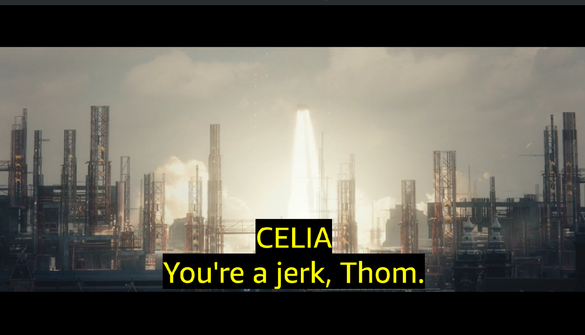

# Sightline on AWS

Two integrations, both reproducible from the repository and both checked on September 4, 2026. Neither changes what the product is: the app still shows only verified data, and the authoring pipeline still ends with a person confirming proposals.

## 1. Publisher delivery: S3 and CloudFront

A publisher ships a caption track and a companion file beside the stream. Sightline reads them from any HTTPS host; on AWS that host is a private S3 bucket behind a CloudFront distribution with origin access control, so the bucket itself is never public.

Layout in the bucket mirrors `assets/`:

```
<scene>/captions.en.vtt        the approved WebVTT track
<scene>/companion.en.json      the verified companion file
<scene>/hls/<name>.m3u8, .m4s  the HLS rendition
```

`tools/aws/publish-media.sh` does the whole thing and is safe to re-run: it creates the bucket (public access blocked, CORS for GET and HEAD), the origin access control and the distribution once, writes their ids to `tools/aws/config.env`, syncs the scenes with the right content types, and invalidates the cache. The app is pointed at the distribution by one line in `apps/vega-player/assets/raw/config.json`:

```json
{ "devHost": "https://dezgz1h32vkd1.cloudfront.net" }
```

Checked on the Vega Virtual Device with that config: the player took the stream from CloudFront, and the caption track and companion file were fetched from it in about a second.

```
[player] source=server host=https://dezgz1h32vkd1.cloudfront.net
[assets] source=remote vtt=1275B companion=yes in 1020 ms
```



If the host does not answer within 1.5 s the app plays the packaged copy (`[player] source=packaged`), so a demo never depends on the network.

Resources: bucket `sightline-media-985151713360` and distribution `E38E44ELXSCMKC` in us-east-1, price class 100. Cost at demo traffic is a few cents a month.

## 2. Amazon Transcribe as a second measurement

The authoring pipeline measures word timing with a local forced aligner (WhisperX) and voice separation with a local diarizer. `tools/author/transcribe_aws.py` adds Amazon Transcribe as an independent second source for both: it uploads the scene audio, runs a job with speaker labels, and turns the result into the same two proposal files the pipeline already understands, `words-transcribe.json` (the align.py shape) and `diarization-transcribe.json` (the diarize.py shape).

Three rules keep it honest:

- The transcript Transcribe hears is never used as caption text. Each recognised word is matched, in order, to the approved words of the cue whose time window contains it; only the timing and the speaker label carry over.
- Everything it writes is `proposed`. Nothing from Transcribe is verified automatically; the review page is where a person confirms it.
- Its main use is a cross-check. Where two independent systems agree, a person can confirm quickly. Where they disagree, that cue goes to the top of the review queue.

Results on the two Tears of Steel scenes (raw results and comparisons in `docs/aws/`):

| Scene | Approved words timed | Speaker label agrees with the track | Onset difference to WhisperX, median | p90 | Within 100 ms |
|---|---|---|---|---|---|
| The bridge (11 cues) | 67 of 76 | 8 of 11 cues | 58 ms | 198 ms | 73% |
| The lab (19 cues) | 60 of 78 | 17 of 18 cues | 27 ms | 97 ms | 91% |

Both jobs finished in under half a minute. The bridge scene has music under the dialogue and a line spoken over a wide shot, which is where the two sources part; the lab is clean speech and they agree closely.

Run it for a scene (the bucket comes from `tools/aws/config.env`):

```bash
AWS_PROFILE=<profile> python3 tools/author/transcribe_aws.py assets/tos-lab/captions.en.vtt assets/tos-lab/.author/audio-16k.wav assets/tos-lab/.author/transcribe --compare assets/tos-lab/.author/words.json
```

Then hand the proposals to the usual step, without `--auto`, so nothing is verified by a rule:

```bash
python3 tools/author/propose.py assets/tos-lab/companion.en.json --words assets/tos-lab/.author/transcribe/words-transcribe.json --diarization assets/tos-lab/.author/transcribe/diarization-transcribe.json
```

## Permissions the two tools need

S3: CreateBucket, PutPublicAccessBlock, PutBucketCors, PutBucketPolicy, PutObject, HeadBucket. CloudFront: CreateOriginAccessControl, ListOriginAccessControls, CreateDistribution, CreateInvalidation, and listing the managed cache, origin request and response headers policies. Transcribe: StartTranscriptionJob, GetTranscriptionJob. STS: GetCallerIdentity.

## Not used

No language model runs anywhere in the product or the pipeline. Transcribe proposes timings and speaker turns; it does not write captions.
